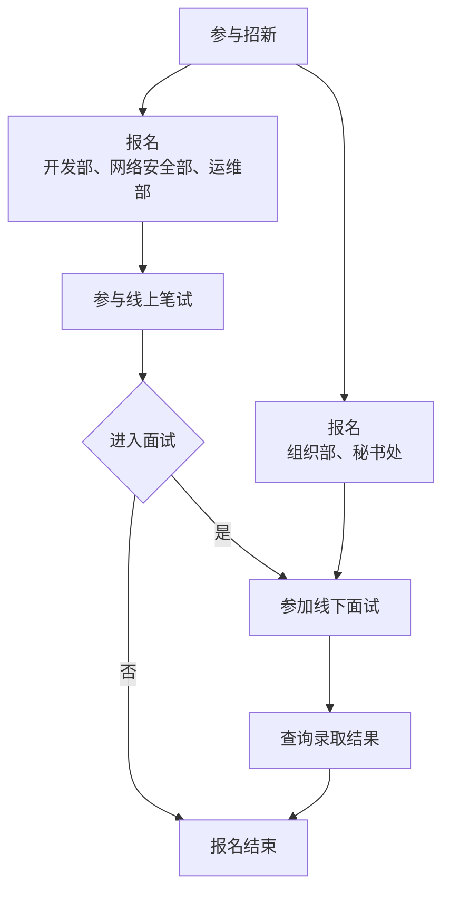

# 加入我们

> [!IMPORTANT]
> 2025年燕山大学大学生网络信息协会招新群群号为 978801324。最新招新动态将会在本群内发布，请大家关注群公告哦

招新流程图如下

## 笔试相关

> [!IMPORTANT]
> 2025年招新笔试系统暂未开放，请耐心等待并关注群公告。

**每个部门都有相应的笔试题目**，你需要在规定时间内上传并提交你的解答。题目大部分为开放性问题，字数不限。你可以使用各种工具进行研究，但需要注意的是，**最终提交的文字内容不能由AI工具生成，并且必须注明所使用的参考资料来源**（例如链接、截图、照片、AI 工具等）。

请大家尽可能多角度、深层次地去分析题目给出的问题，力求回答的详细、透彻，并注意标明所选题目。

如有笔试系统相关问题，请加入招新群并提问。

## 招新Q&A

- Q：招新流程是什么样的？
  - A：
  1. 发布技术类部门的笔试题目（开发、网安、运维）（预计下周一零点发布）  
  2. 网上填写报名表（技术类部门需要额外一并提交笔试题目答案）（填报系统从试题发布开始到周二晚24点截止）  
  3. 发布进入面试的同学名单（预计周三白天，请大家及时关注群消息）  
  4. 面试（预计周三晚上东区和周四下午晚上西区）  
- Q：笔试会很难嘛？我是小白，啥都不会诶
  - A：  
   1. 笔试不会很难，具体题型不涉及客观题，都是较为开放的主观题，且不涉及编程题。  
   2. 在笔试试卷发布到截止提交的两天时间内，允许大家用各种办法把题目答出来，包括网络搜索或者询问AI，但是不能询问真人  
   3. 最重要的是，笔试考察大家的学习能力和信息检索能力，所以希望大家在网上查到答案后，把内容理解之后用自己的语言进行作答，杜绝原封不动的复制网上的内容哦。  
   4. 对于你的笔试答卷，我们在面试的时候有可能进行针对性提问。  
- Q：公开课讲什么？
  - A：  
  公开课主要为三个技术类部门（开发、网安、运维）的部长为大家分享一些有趣的技术类小知识，偏向于启发性和引导性，不涉及深奥的技术细节，为了让大家对我们三个部门有更多的了解，我们在公开课结束后，准备了提问和答疑环节，大家对网协招新有任何不清楚的都可以提问。偷偷说一句，笔试题目中很有可能出现公开课中讲过的主题哦~
